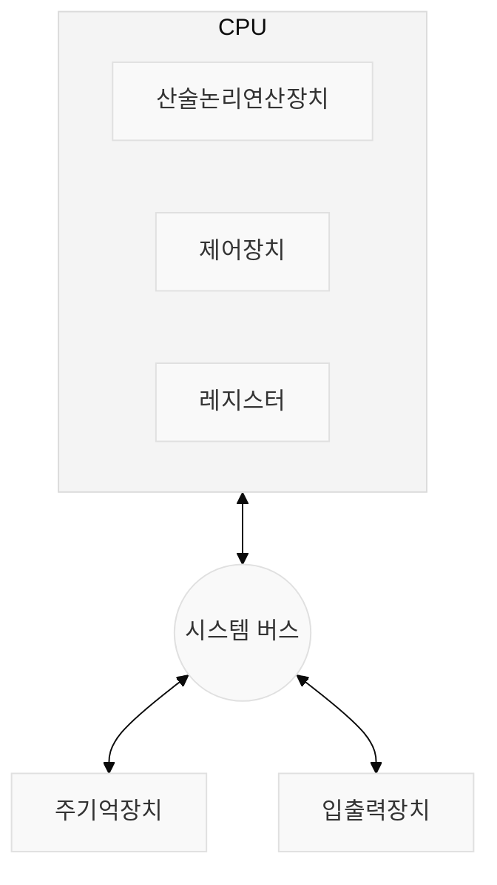
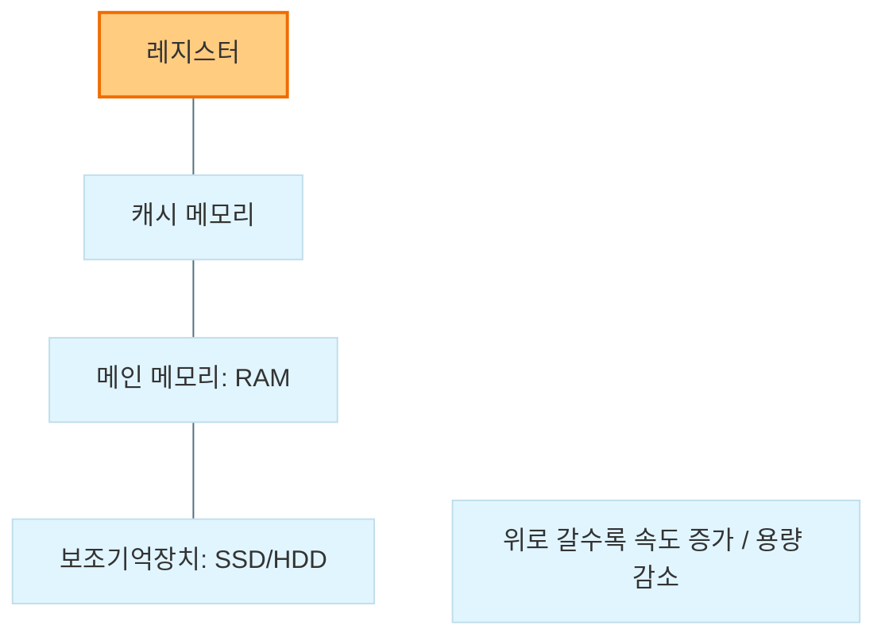

## [Chapter 01] 컴퓨터시스템 개요

컴퓨터 시스템의 근간을 이루는 하드웨어와 소프트웨어의 기본 구조, 그리고 데이터를 다루는 방식과 발전 역사를 다룹니다.

### 1.1 컴퓨터의 기본 구조
* 중앙처리장치(CPU): 프로그램의 명령어를 해독하고 실행하는 두뇌 역할. 산술논리연산장치(ALU), 제어장치(Control Unit), 내부 레지스터들로 구성.
* 기억장치(Memory):
  * 주기억장치: 실행 중인 프로그램과 데이터를 저장 (RAM, ROM). 속도가 빠르지만 휘발성.
  * 보조기억장치: 대용량 데이터를 영구적으로 저장 (SSD, HDD). 주기억장치에 비해 속도가 느림.
* 입출력장치(I/O Devices): 사용자와 컴퓨터 간의 인터페이스 역할 (키보드, 마우스, 모니터 등).
* 시스템 버스(System Bus): 구성 요소들 간의 데이터 통로.
  * 데이터 버스: 실제 데이터가 이동.
  * 주소 버스: 데이터가 읽히거나 쓰일 메모리의 위치(주소) 전달.
  * 제어 버스: 읽기/쓰기 신호 등 제어 신호 전달.

### 1.2 정보의 표현과 저장
* 정보의 단위: 비트(Bit) -> 니블(Nibble, 4bit) -> 바이트(Byte, 8bit) -> 워드(Word, CPU가 한 번에 처리하는 데이터 크기).
* 진법 및 데이터 표현: 컴퓨터는 0과 1의 2진수로 모든 정보를 처리. 가독성을 위해 8진수나 16진수로 변환하여 표현하기도 함.
* 문자 표현: 아스키코드(ASCII, 7bit), 유니코드(Unicode, 다국어 지원) 등을 통해 문자를 이진 코드로 매핑.

### 1.3 시스템의 구성
* 하드웨어와 소프트웨어의 상호작용: 사용자가 응용 소프트웨어를 통해 작업을 요청하면, 시스템 소프트웨어(운영체제)가 하드웨어 자원을 할당하여 연산을 수행.
* 메모리 계층 구조: 레지스터 -> 캐시 메모리 -> 메인 메모리 -> 보조기억장치 순으로 속도/용량/비용의 트레이드오프를 활용해 시스템 성능을 최적화.

### 1.4 컴퓨터 구조의 발전 과정
* 폰노이만 아키텍처: 프로그램과 데이터를 메모리에 내장시켜 두고, 순차적으로 읽어와 실행하는 '내장 프로그램(Stored-program)' 방식 도입. 현재 대부분 컴퓨터의 기본 구조.
* 발전 세대: 1세대(진공관) -> 2세대(트랜지스터) -> 3세대(집적회로, IC) -> 4세대(고밀도 집적회로, VLSI).
  * 칩에 집적되는 트랜지스터의 수가 기하급수적으로 늘어나는 무어의 법칙(Moore's Law) 적용.

| 세대 | 주요 소자 | 특징 |
| :--- | :--- | :--- |
| 1세대 | 진공관 (Vacuum Tube) | 부피가 크고 전력 소모 및 발열이 심함 |
| 2세대 | 트랜지스터 (Transistor) | 크기 감소, 신뢰성 향상, 운영체제 개념 등장 |
| 3세대 | 집적회로 (IC) | 시분할 처리, 다중 프로그래밍 가능 |
| 4세대 | 고밀도 집적회로 (VLSI) | 마이크로프로세서 개발, 개인용 컴퓨터(PC) 보급 |
