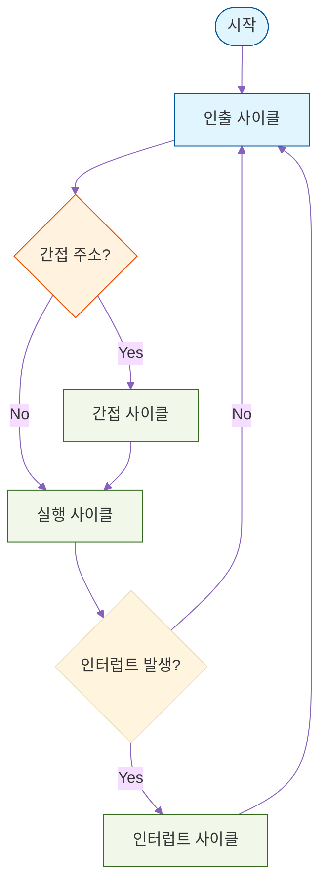
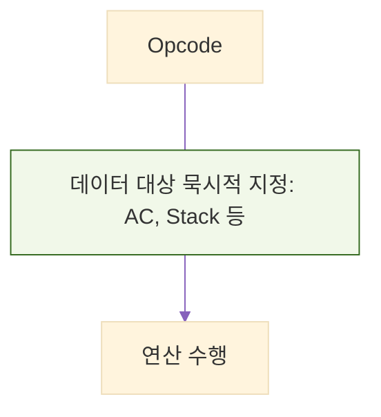
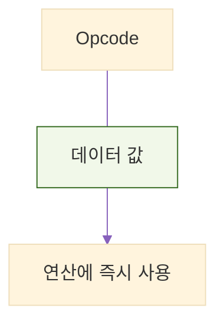
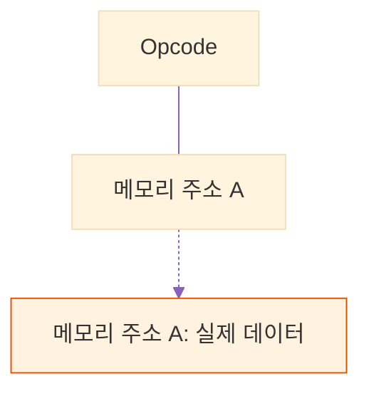
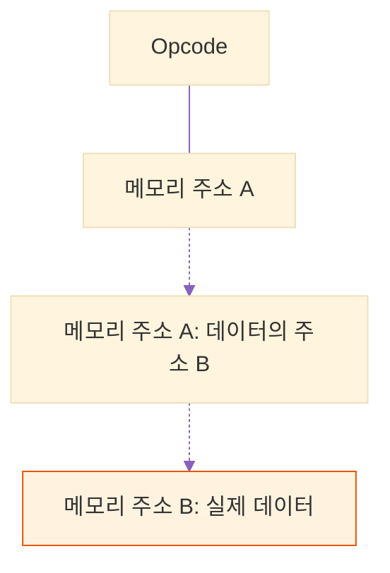
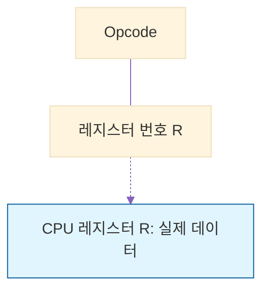
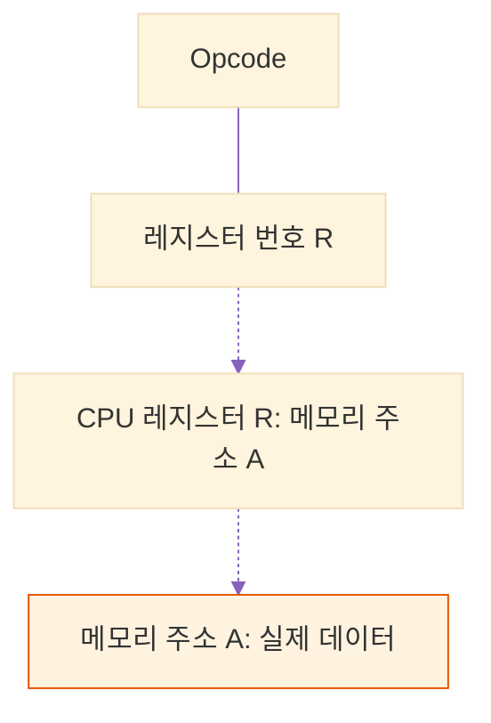
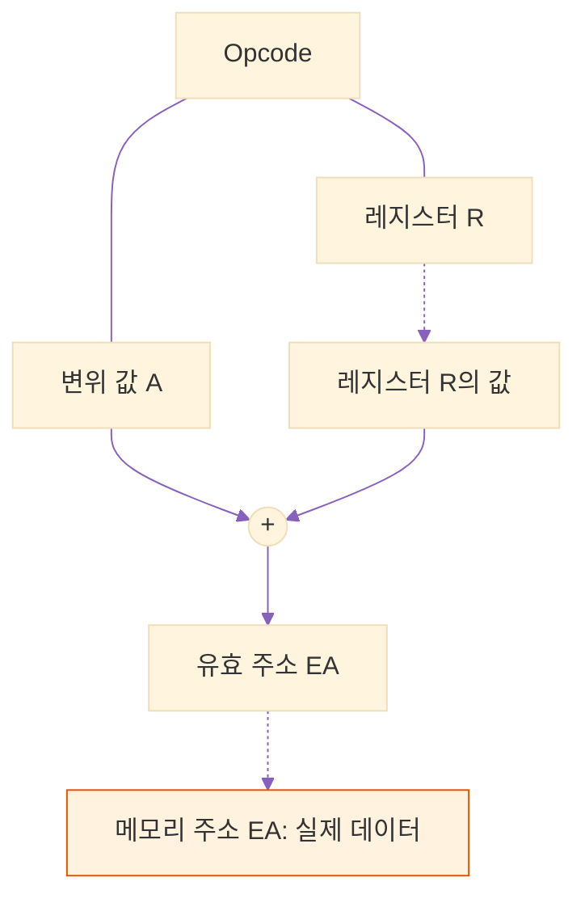
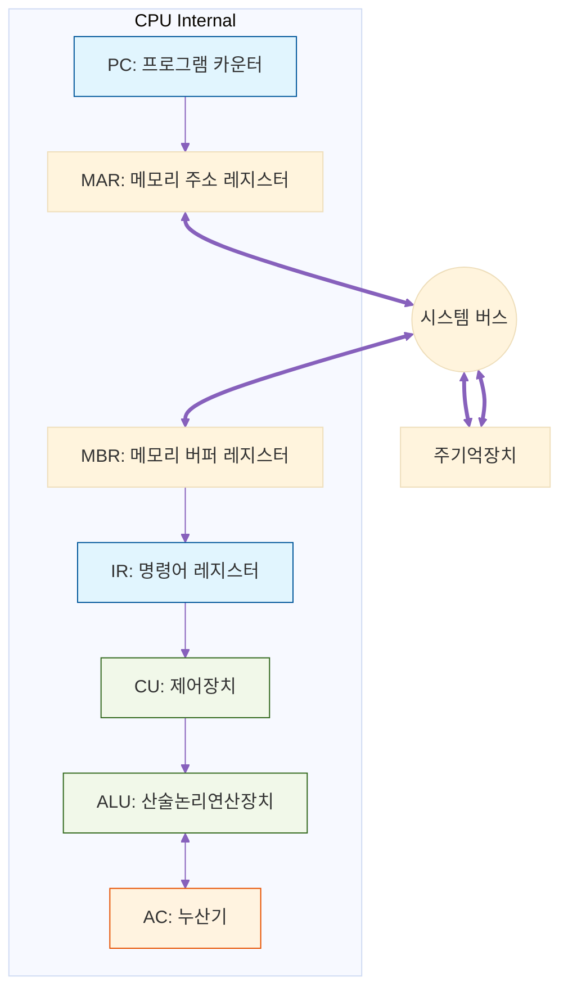

## [Chapter 02] CPU의 구조와 기능

명령어가 실제로 어떻게 인출되고 처리되는지 CPU 내부의 세부 동작과 성능 향상 기법을 다룹니다.

### 2.1 CPU의 내부 구성 요소
* ALU (산술논리연산장치): 덧셈, 뺄셈 등의 산술 연산과 AND, OR 등의 논리 연산을 수행.
* 제어장치 (Control Unit): 명령어를 해독하고, 이를 수행하기 위한 제어 신호를 생성하여 시스템 각 부품에 전달.
* 주요 레지스터 (Registers):
  * PC (Program Counter): 다음에 실행할 명령어의 주소를 저장.
  * IR (Instruction Register): 현재 실행 중인 명령어를 저장.
  * AC (Accumulator): 연산의 중간 결과를 임시로 저장.
  * MAR (Memory Address Register): 메모리에 접근하기 위한 주소를 저장.
  * MBR (Memory Buffer Register): 메모리에서 읽어오거나 저장할 데이터를 보관.

### 2.2 명령어 사이클 (Instruction Cycle)
CPU가 하나의 명령어를 처리하는 전체 과정입니다.
1. 인출 사이클 (Fetch): PC가 가리키는 주소에서 명령어를 메모리로부터 읽어와 IR에 저장하고, PC 값을 증가시킴.
2. 실행 사이클 (Execute): IR에 있는 명령어를 해독하고, 필요한 오퍼랜드(데이터)를 가져와 연산을 수행.
3. 간접 사이클 (Indirect): 명령어에 포함된 주소가 실제 데이터의 주소를 가리키는 포인터일 때, 유효 주소를 한 번 더 메모리에서 읽어옴.
4. 인터럽트 사이클 (Interrupt): 예외 상황이나 외부 장치의 요청이 발생하면 현재 상태를 저장하고 인터럽트 서비스 루틴(ISR)을 처리.

### 2.3 명령어 파이프라이닝 (Pipelining)
* 개념: 하나의 명령어가 실행되는 과정을 여러 단계(예: 인출 -> 해독 -> 실행 -> 쓰기)로 나누어, 여러 명령어를 공장의 컨베이어 벨트처럼 겹쳐서 동시에 실행하는 성능 향상 기법.
* 파이프라인 해저드 (Hazards): 파이프라인의 흐름을 방해하는 요소.
  * 구조적 해저드: 자원(메모리 등) 충돌.
  * 데이터 해저드: 이전 명령어의 결과를 다음 명령어가 바로 필요로 할 때 발생.
  * 제어 해저드: 분기(Branch) 명령어로 인해 PC 값이 갑자기 변경될 때 발생.

### 2.4 명령어 세트와 주소지정 방식 (상세 확장)

명령어(Instruction)는 컴퓨터에게 무엇을 할지 지시하는 '연산 코드(Opcode)'와 연산의 대상이 되는 데이터의 위치나 값을 나타내는 '오퍼랜드(Operand)'로 구성됩니다. 

오퍼랜드 필드에 할당된 비트 수는 한정되어 있는 반면, 컴퓨터의 전체 메모리 공간은 매우 큽니다. 따라서 제한된 비트 수만으로 넓은 메모리 공간에 있는 데이터의 '실제 위치(유효 주소, Effective Address)'를 효율적으로 찾아가기 위해 다양한 **주소지정 방식(Addressing Modes)**이 고안되었습니다.

---

#### 1. 묵시적 주소지정 방식 (Implied Addressing)
명령어 자체에 어떤 데이터를 다룰지가 이미 내포되어 있어서, 오퍼랜드 필드가 아예 필요 없는 방식입니다.
* 특징: 주로 누산기(AC)나 스택(Stack)의 최상단 데이터를 기본 대상으로 삼습니다.
* 장점: 명령어가 짧고, 메모리 접근이 필요 없습니다.
* 단점: 사용할 수 있는 명령어가 제한적입니다.
* 예시: `ADD` (스택의 최상단 두 값을 더함), `INC` (누산기의 값을 1 증가시킴)

#### 2. 즉치 주소지정 방식 (Immediate Addressing)
오퍼랜드 필드에 데이터가 있는 위치(주소)가 아니라, 연산에 사용할 '실제 데이터 값' 자체가 직접 들어있는 방식입니다.
* 특징: 변수가 아닌 상수값을 레지스터에 초기화할 때 주로 사용합니다.
* 장점: 데이터를 가져오기 위해 메모리에 접근할 필요가 없으므로 속도가 가장 빠릅니다.
* 단점: 오퍼랜드 필드의 비트 수만큼만 수의 크기를 표현할 수 있어 다룰 수 있는 값의 범위가 매우 작습니다.

#### 3. 직접 주소지정 방식 (Direct Addressing)
오퍼랜드 필드에 실제 데이터가 저장된 메모리의 '유효 주소(EA)'가 그대로 적혀있는 방식입니다.
* 유효 주소 계산: EA = 오퍼랜드 값
* 장점: 유효 주소를 구하기 위한 추가 계산이 필요 없고, 메모리 접근도 한 번만 하면 됩니다.
* 단점: 오퍼랜드 필드의 비트 수에 의해 접근할 수 있는 전체 메모리 용량이 제한됩니다. (예: 오퍼랜드가 8비트면 256번지까지만 접근 가능)

#### 4. 간접 주소지정 방식 (Indirect Addressing)
오퍼랜드 필드가 가리키는 메모리 주소에 가보면, 데이터가 있는 것이 아니라 '실제 데이터가 있는 진짜 메모리 주소(포인터)'가 들어있는 방식입니다.
* 유효 주소 계산: EA = (오퍼랜드가 가리키는 메모리 안의 값)
* 장점: 메모리의 한 워드 전체 길이를 주소로 사용할 수 있어, 직접 주소지정 방식의 메모리 공간 제한 문제를 해결할 수 있습니다.
* 단점: 실제 데이터를 가져오기 위해 메모리를 최소 2번(주소 읽기용 1번, 데이터 읽기용 1번) 방문해야 하므로 실행 속도가 느립니다.

#### 5. 레지스터 주소지정 방식 (Register Addressing)
직접 주소지정 방식과 비슷하지만, 대상이 메모리가 아니라 CPU 내부의 '레지스터'인 방식입니다.
* 유효 주소 계산: EA = 레지스터 번호
* 장점: CPU 내부에서 데이터가 이동하므로 메모리 접근이 아예 없어 실행 속도가 매우 빠릅니다. 또한, CPU 내 레지스터 개수는 적으므로 오퍼랜드 필드의 비트 수가 적어도 됩니다.
* 단점: 데이터를 저장할 수 있는 공간(레지스터의 수)이 매우 제한적입니다.

#### 6. 레지스터 간접 주소지정 방식 (Register Indirect Addressing)
간접 주소지정 방식을 응용한 것으로, 오퍼랜드 필드가 지정하는 '레지스터' 안에 실제 데이터가 있는 '메모리 주소'가 들어있는 방식입니다.
* 유효 주소 계산: EA = (레지스터 안의 값)
* 장점: 넓은 메모리 공간에 접근할 수 있으면서도, 일반 간접 주소지정 방식보다 메모리 접근 횟수가 1회 적어(레지스터 참조 1번 + 메모리 접근 1번) 속도 면에서 더 유리합니다.

#### 7. 변위 주소지정 방식 (Displacement Addressing)
가장 강력하고 복잡한 방식으로, 오퍼랜드 필드의 값(A)과 특정 레지스터의 값(R)을 더하여 실제 유효 주소를 계산하는 방식입니다. 어떤 레지스터를 기준(더하는 값)으로 삼느냐에 따라 3가지로 나뉩니다.
* 유효 주소 계산: EA = A + (R)

  * (1) 상대 주소지정 (Relative Addressing): 
    * 프로그램 카운터(PC)를 레지스터(R)로 사용합니다. (EA = A + PC)
    * 주로 IF문, FOR문 같은 분기 명령어에서 "현재 위치(PC)로부터 앞뒤로 몇 칸 이동해라"라고 지정할 때 사용합니다. 메모리를 효율적으로 사용할 수 있습니다.
  
  * (2) 베이스 레지스터 주소지정 (Base Register Addressing):
    * 베이스 레지스터를 사용합니다. (EA = A + BR)
    * 다중 프로그래밍 환경에서 프로그램이 메모리의 어느 위치에 적재되든, 시작 주소만 베이스 레지스터에 넣고 오퍼랜드(A)를 떨어진 거리(변위)로 사용하여 쉽게 위치를 찾아갈 때 유용합니다.
  
  * (3) 인덱스 주소지정 (Indexed Addressing):
    * 인덱스 레지스터를 사용합니다. (EA = A + IX)
    * 배열(Array)이나 연속된 데이터 블록에 순차적으로 접근할 때 매우 유용합니다. 오퍼랜드(A)에 배열의 시작 주소를 넣고, 인덱스 레지스터(IX)의 값을 0, 1, 2... 순으로 증가시키며 연산을 반복 수행합니다.

### 2.5 CPU 내부 데이터 흐름 (Data Path)
명령어 인출 및 실행 과정에서 각 레지스터 간의 데이터 이동 경로를 나타냅니다.

