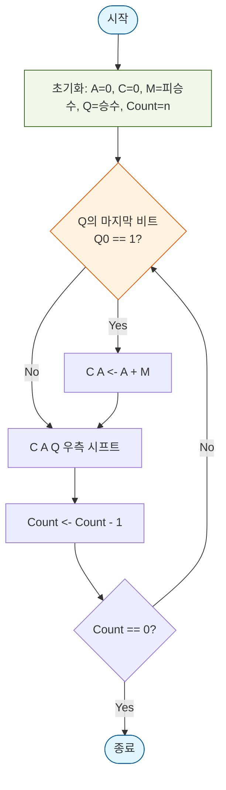
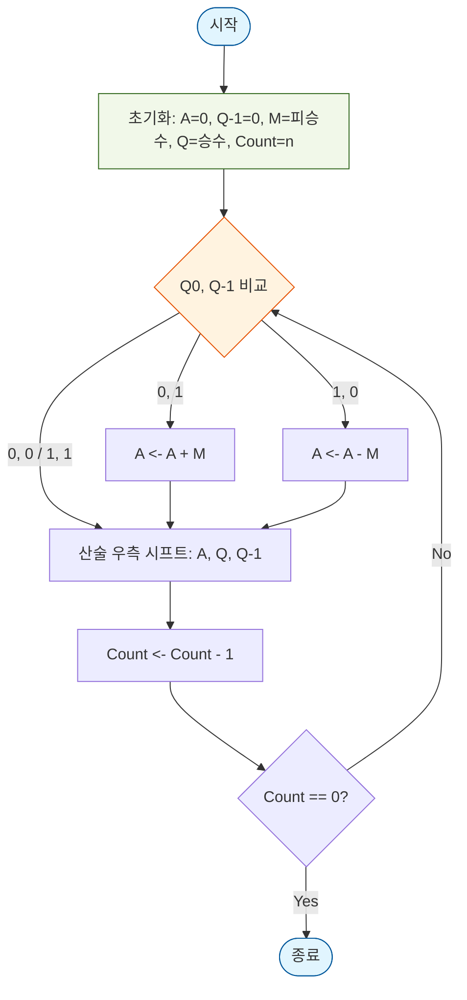
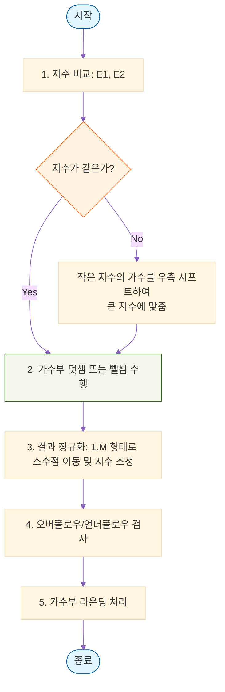
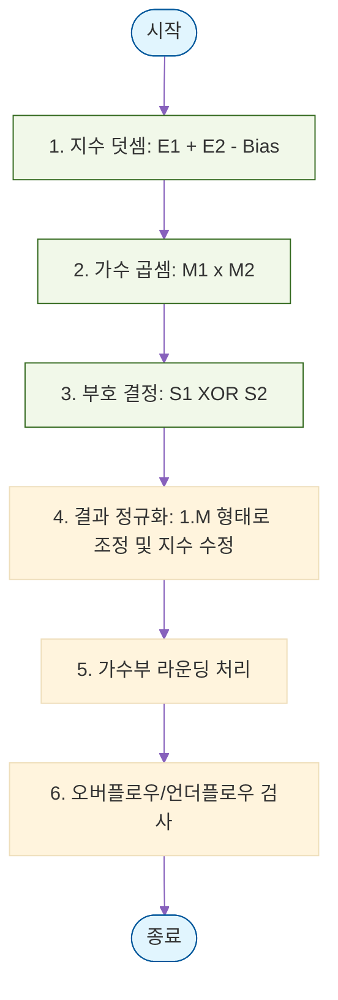
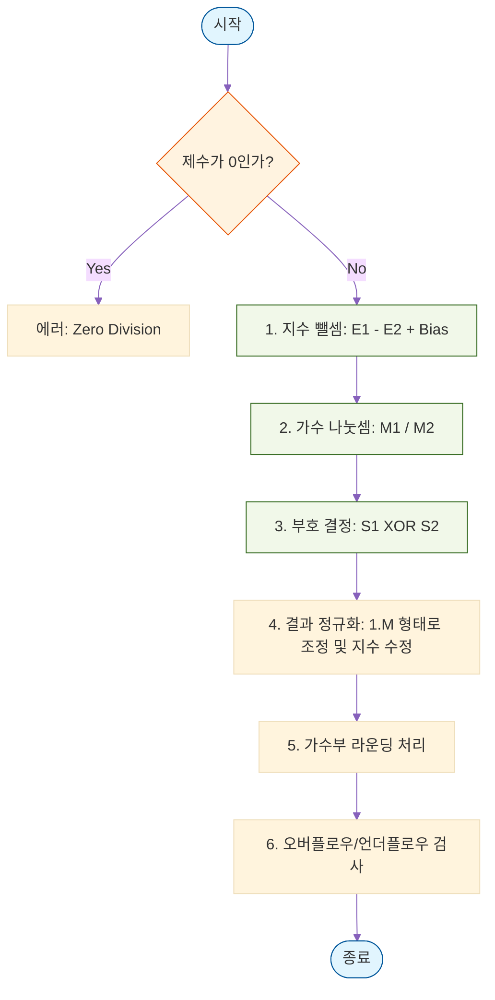

## [Chapter 03] 컴퓨터 산술과 논리 연산

컴퓨터 내부에서 데이터(정수 및 실수)가 어떻게 표현되고, 실제 사칙연산과 논리연산이 어떻게 이루어지는지 다룹니다.

### 3.1 정수의 표현
* 부호 없는 정수 (Unsigned): 모든 비트를 수의 크기를 나타내는 데 사용.
* 부호 있는 정수 (Signed): 최상위 비트(MSB)를 부호 비트(0: 양수, 1: 음수)로 사용.
  * 부호화 크기 표현: MSB만 부호이고 나머지는 크기. (연산이 복잡함)
  * 1의 보수: 음수를 표현할 때 0은 1로, 1은 0으로 비트 반전. (+0, -0 두 개의 0이 존재하는 단점)
  * 2의 보수 (주로 사용): 1의 보수에 1을 더한 값. 하나의 0만 존재하며 가산기만으로 뺄셈까지 수행 가능하여 현대 컴퓨터의 표준 정수 표현 방식임.

### 3.2 정수의 연산

컴퓨터 내부의 산술논리연산장치(ALU)에서 정수의 사칙연산이 어떻게 하드웨어적으로 처리되는지 상세히 다룹니다. 현대 컴퓨터는 정수 표현에 주로 '2의 보수(2's Complement)' 체계를 사용합니다.

---

#### 1. 덧셈 (Addition)
2의 보수 체계에서의 덧셈은 사람이 10진수 덧셈을 하는 방식과 거의 동일하게 이진수 가산기(Adder)를 통해 수행됩니다.
* 동작 원리: 오른쪽 끝 비트(LSB)부터 왼쪽으로 비트 단위 덧셈을 수행합니다. 
* 올림수(Carry) 처리: 각 비트 덧셈에서 발생한 올림수는 바로 위 상위 비트 덧셈에 포함됩니다.
* 최상위 비트(MSB) 캐리: 덧셈 결과 최상위 비트(부호 비트)를 넘어가는 캐리가 발생할 경우, 이는 저장할 공간이 없으므로 시스템에서 단순하게 무시(버림)합니다.
  (예: 4비트 연산에서 1101 + 0110 = (1)0011 이 되면, 앞의 1은 버리고 0011만 취합니다.)

#### 2. 뺄셈 (Subtraction)
컴퓨터는 하드웨어의 복잡도와 비용을 줄이기 위해 '감산기(Subtractor)'를 따로 두지 않고 '가산기(Adder)'를 재사용하여 뺄셈을 수행합니다.
* 동작 원리: A - B 연산을 A + (-B) 의 형태로 변환하여 계산합니다.
* 수행 과정:
  1. 빼는 수인 B의 2의 보수를 구합니다. (모든 비트를 0은 1로, 1은 0으로 반전시킨 후, 결과에 1을 더함)
  2. A와 2의 보수가 취해진 B를 가산기를 통해 덧셈합니다.
* 즉, 가산기 하드웨어 앞단에 비트 반전기(NOT 게이트)를 두고 제어 신호를 통해 1을 더해주는 방식으로 뺄셈을 효율적으로 처리합니다.

#### 3. 오버플로우 (Overflow)
연산의 결과가 컴퓨터가 할당한 비트 수로 표현할 수 있는 값의 범위를 넘어설 때 발생하는 오류입니다.
* 발생 조건: 부호가 같은 두 수를 더했을 때만 발생할 수 있습니다. (양수+음수에서는 절대 발생하지 않음)
  * 양수 + 양수 를 했는데 결과의 부호 비트가 음수(1)로 나올 때.
  * 음수 + 음수 를 했는데 결과의 부호 비트가 양수(0)로 나올 때.
* 하드웨어적 판별: 최상위 비트(MSB)로 들어오는 올림수(Carry In)와 최상위 비트에서 나가는 올림수(Carry Out)를 XOR 연산합니다. 두 값이 서로 다르면(XOR 결과가 1이면) 오버플로우가 발생한 것으로 판별합니다.

---

#### 4. 곱셈 (Multiplication) - 2가지 주요 방법
곱셈은 덧셈과 시프트(Shift, 자리이동) 연산의 조합으로 이루어집니다. 부호 유무에 따라 처리 방식이 다릅니다.

##### 방법 1: 부호 없는 정수의 곱셈 (Unsigned Multiplication / Add & Shift)
사람이 종이에 두 수를 곱하는 방식(초등학교에서 배우는 세로 곱셈)을 컴퓨터 하드웨어로 구현한 가장 직관적인 방법입니다.
* 구성 요소: 피승수(Multiplicand, 곱해지는 수), 승수(Multiplier, 곱하는 수), 그리고 결과를 누적할 레지스터가 필요합니다.
* 동작 과정:
  1. 승수의 맨 오른쪽 비트(LSB)를 검사합니다.
  2. 해당 비트가 '1'이면 피승수를 누적 결과에 더합니다.
  3. 해당 비트가 '0'이면 아무것도 더하지 않습니다 (혹은 0을 더합니다).
  4. 덧셈 후, 결과와 승수가 들어있는 레지스터 전체를 오른쪽으로 1비트 시프트(Shift Right) 합니다.
  5. 승수의 모든 비트를 검사할 때까지 위 과정(비트 수만큼의 사이클)을 반복합니다.

* 단점: 부호 있는 2의 보수 음수가 포함되면 결과가 완전히 틀려지기 때문에, 음수일 경우 부호를 절대값으로 바꾼 뒤 곱셈을 하고 마지막에 부호를 다시 붙여주는 복잡한 전후 처리 과정이 필요합니다.

##### 방법 2: 부호 있는 정수의 곱셈 (부스 알고리즘, Booth's Algorithm)
음수(2의 보수)가 포함된 곱셈을 부호 변환 없이 하드웨어에서 직접적이고 효율적으로 처리하기 위해 고안된 알고리즘입니다. 현대 컴퓨터 곱셈기의 핵심 원리입니다.
* 핵심 원리: 승수 내에 '1'이 연속해서 나타나는 패턴을 찾아 이를 하나의 뺄셈과 덧셈으로 단순화합니다.
  (예를 들어 0111(7)을 곱할 때, 3번 연달아 더하는 대신 1000(8)을 더하고 0001(1)을 빼는 방식으로 처리)
* 동작 과정:
  1. 승수의 현재 비트($Q_0$)와 그 오른쪽에 가상의 이전 비트($Q_{-1}$, 초기값은 0)를 함께 비교합니다.
  2. 두 비트 상태( $Q_0, Q_{-1}$ )에 따라 다음 중 하나를 수행합니다:
     * `0 0` 또는 `1 1`: 아무것도 더하거나 빼지 않습니다. (연속된 0이거나 연속된 1의 중간 구간)
     * `0 1`: 누적기에 피승수를 '더합니다'. (연속된 1의 패턴이 끝나는 지점)
     * `1 0`: 누적기에서 피승수를 '뺍니다'. (연속된 1의 패턴이 시작되는 지점)
  3. 연산 수행 후, 결과 레지스터를 '산술 우측 시프트(Arithmetic Shift Right)' 합니다. (이때 맨 왼쪽 부호 비트는 그대로 유지하면서 우측으로 이동시켜 부호를 보존합니다.)
  4. 정해진 비트 수만큼 이 과정을 반복합니다.

* 장점: 음수 곱셈을 완벽히 지원하며, 승수에 1이 연속적으로 많이 포함되어 있을 경우 실제 덧셈/뺄셈(ALU 연산)을 수행하는 횟수가 획기적으로 줄어들어 연산 속도가 빨라집니다.

### 3.3 부동소수점 수의 표현 (실수 표현)
매우 크거나 작은 수를 효율적으로 표현하기 위해 과학적 표기법을 차용합니다.
* IEEE 754 표준 포맷: 
  * 단일 정밀도(32bit): 부호(1bit) + 지수대(8bit) + 가수대(23bit)
  * 복수 정밀도(64bit): 부호(1bit) + 지수대(11bit) + 가수대(52bit)
* 정규화 (Normalization): 소수점 이상의 값을 1로 맞추어 표현하는 방식 ($1.M \times 2^E$). 가수부의 저장 효율을 극대화.
* 바이어스 지수 (Biased Exponent): 지수부에 음수를 포함하기 위해 실제 지수값에 특정 바이어스 값(32bit의 경우 127)을 더하여 0과 양수로만 저장.

### 3.4 부동소수점 산술 연산

부동소수점(실수) 연산은 정수 연산보다 하드웨어 구성이 훨씬 복잡하고 처리 시간이 오래 걸립니다. 수의 표현이 부호(Sign), 지수(Exponent), 가수(Mantissa/Significand) 세 부분으로 나뉘어 있기 때문에, 각 부분을 독립적으로 처리한 후 하나로 합치는 단계적인 과정이 필요합니다.

---

#### 1. 덧셈과 뺄셈 (Addition and Subtraction)
부동소수점 덧셈과 뺄셈의 핵심은 '소수점 위치 맞추기(지수 정렬)'입니다. 과학적 표기법에서 $1.2 \times 10^3$과 $3.4 \times 10^2$를 바로 더할 수 없는 것과 같은 원리입니다.

* 수행 과정:
  1. 지수 비교 및 정렬 (Alignment): 두 수의 지수 값을 비교합니다. 지수가 작은 쪽의 가수를 오른쪽으로 시프트(Shift Right)하여 두 수의 지수를 큰 쪽에 맞춥니다.
     (예: $1.01 \times 2^3$ 과 $1.10 \times 2^1$ 을 더할 때, 두 번째 수의 지수를 $2^3$으로 맞추기 위해 가수를 $0.011$ 로 변경합니다.)
  2. 가수 덧셈/뺄셈: 지수가 같아졌으므로, 두 수의 가수부끼리 덧셈이나 뺄셈을 수행합니다. 부호 비트를 고려하여 실제 연산이 결정됩니다.
  3. 정규화 (Normalization): 연산 결과의 가수가 다시 $1.M$ 형태가 되도록 조정합니다.
     * 덧셈 후 가수가 2 이상이 되어 자리올림이 발생하면: 가수를 오른쪽으로 1비트 시프트하고 지수를 1 증가시킵니다.
     * 뺄셈 후 가수가 1보다 작아지면(예: $0.001...$ 형태): 첫 번째 '1'이 정수부로 올 때까지 가수를 왼쪽으로 시프트하고, 이동한 칸 수만큼 지수를 감소시킵니다.
  4. 라운딩 (Rounding): 결과 가수가 할당된 비트 수(예: 32비트 포맷에서는 23비트)를 초과할 경우, 반올림 규칙에 따라 초과된 비트를 처리합니다.

#### 2. 곱셈 (Multiplication)
곱셈은 덧셈/뺄셈과 달리 지수를 미리 맞출 필요가 없습니다. 지수는 지수끼리 더하고, 가수는 가수끼리 곱하는 방식으로 독립적으로 진행됩니다.

* 수행 과정:
  1. 지수 덧셈 (Add Exponents): 두 수의 지수를 더합니다. 단, IEEE 754 표준에서는 바이어스(Bias, 32비트 기준 127)가 포함된 지수를 사용하므로, 단순히 둘을 더하면 바이어스가 두 번 더해지는 오류가 생깁니다. 따라서 `(지수1 + 지수2) - 바이어스`를 계산해야 올바른 새 지수값이 됩니다.
  2. 가수 곱셈 (Multiply Mantissas): 두 수의 가수부를 곱합니다. (일반적인 정수 곱셈 하드웨어 사용)
  3. 부호 결정 (Determine Sign): 두 수의 부호 비트를 XOR 연산합니다. (부호가 같으면 0/양수, 다르면 1/음수)
  4. 정규화 (Normalization): 가수끼리의 곱셈 결과가 $10.XX...$ 형태로 2 이상이 될 수 있습니다. 이때는 가수를 오른쪽으로 1비트 시프트하고 지수를 1 증가시켜 $1.M$ 형태로 맞춥니다.
  5. 라운딩 (Rounding): 지정된 비트 수에 맞춰 가수부를 반올림합니다.

#### 3. 나눗셈 (Division)
나눗셈 역시 지수와 가수를 분리하여 처리합니다. 원리는 곱셈의 반대입니다.

* 수행 과정:
  1. 지수 뺄셈 (Subtract Exponents): 피제수(나누어지는 수)의 지수에서 제수(나누는 수)의 지수를 뺍니다. 이때 바이어스가 완전히 사라져버리기 때문에, `(지수1 - 지수2) + 바이어스`를 계산하여 바이어스를 다시 더해줍니다.
  2. 가수 나눗셈 (Divide Mantissas): 피제수의 가수를 제수의 가수로 나눕니다.
  3. 부호 결정 (Determine Sign): 두 수의 부호 비트를 `XOR` 연산합니다.
  4. 정규화 및 라운딩: 나눗셈 결과의 가수가 $1.M$ 형태를 벗어나면 시프트 연산 및 지수 조정을 수행한 후 반올림을 적용합니다.

#### ※ 부동소수점 연산의 주요 오류 및 한계점
* 오버플로우 (Overflow): 연산 결과의 지수가 허용된 최대 지수값을 초과할 때 발생합니다. (보통 무한대(Infinity)로 처리됨)
* 언더플로우 (Underflow): 연산 결과의 지수가 허용된 최소 지수값보다 작아질 때 발생합니다. 0에 너무 가까워져서 표현할 수 없으므로 0으로 간주해버립니다.
* 정밀도 손실 (정보 소실): 덧셈/뺄셈 시 지수 차이가 매우 큰 두 수를 연산하면, 지수를 맞추는 과정에서 작은 수의 가수를 오른쪽으로 너무 많이 시프트하게 됩니다. 이때 작은 수의 유효 숫자 비트들이 범위를 벗어나 모두 잘려나가면서, 덧셈을 했음에도 사실상 큰 수만 남게 되는 문제가 발생할 수 있습니다.
