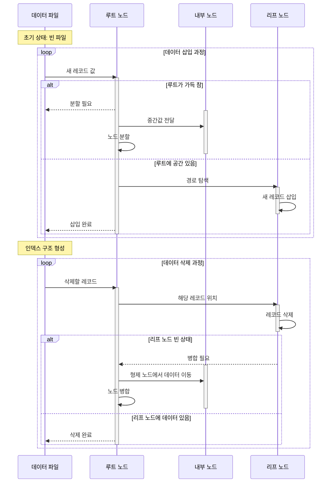

## CHAPTER 06. SQL 활용

데이터베이스의 구조를 관리하고 성능과 보안을 최적화하는 방법을 배웁니다.

### 1. 테이블 관리 (DDL)

>뷰와 인덱스는 수정 불가

- CREATE TABLE: 데이터 유형(INT, VARCHAR, DATE 등)과 제약 조건(PRIMARY KEY, UNIQUE, FOREIGN KEY)을 설정하여 테이블을 생성합니다.

- ALTER / DROP: 테이블에 열을 추가·삭제하거나 구조를 변경하며, 필요 없는 테이블은 삭제합니다.
- TRUNCATE : 테이블의 모든 데이터를 삭제합니다.

```sql
CREATE TABLE 회원 (
    성별 char(1) constraint GENDER_CHECK check ((성별 = 'M') or (성별 = 'W'))
    이름 varchar(10) not null,
    전화 varchar(13) null,
    나이 int(3) not null,
    생년월일 date not null,
    주소 varchar(100) not null,
    PRIMARY KEY (회원번호)
);

CREATE TABLE 수강(
    회원번호 char(5) not null,
    과목명 varchar(20) not null,
    평가학점 char(1) null,
    PRIMARY KEY (회원번호, 과목명),
    FOREIGN KEY REFERENCES 회원(회원번호)
);

DESC 회원;
```

### 2. 사용자 권한 관리 (DCL)

- CREATE USER로 계정을 만들고, GRANT로 권한(SELECT, INSERT 등)을 부여하며, REVOKE로 이를 철회합니다.

`CREATE USER '유저이름' IDENTIFIED BY '비밀번호';`

`GRANT ALL PRIVILEGES ON adb.* TO '유저이름' IDENTIFIED BY '비밀번호';`

`REVOKE ALL PRIVILEGES ON adb.* FROM '유저이름';`


### 3. 뷰 (View)

- 실제 데이터를 저장하지 않는 **가상** 테이블로, 복잡한 질의를 단순하게 만들거나 특정 데이터만 노출하여 **보안을 강화**하는 데 유리합니다.
- 1:n, m:1 가능

`CREATE VIEW 뷰이름(컬럼1, 컬럼2, ...) AS (sub quary);`

`DROP VIEW 뷰이름;`

> 검색은 제한 없이 가능하나, 수정은 제한된다.(될 때 있고 안 될 때 있음.)

### 4. 인덱스 (Index)

- 데이터 검색 속도를 높이기 위한 객체로, 주로 B-트리 구조를 사용합니다.

- 검색에는 효과적이지만 데이터 변경이 잦은 곳에 남용하면 오히려 성능이 떨어질 수 있으니 주의가 필요합니다.

