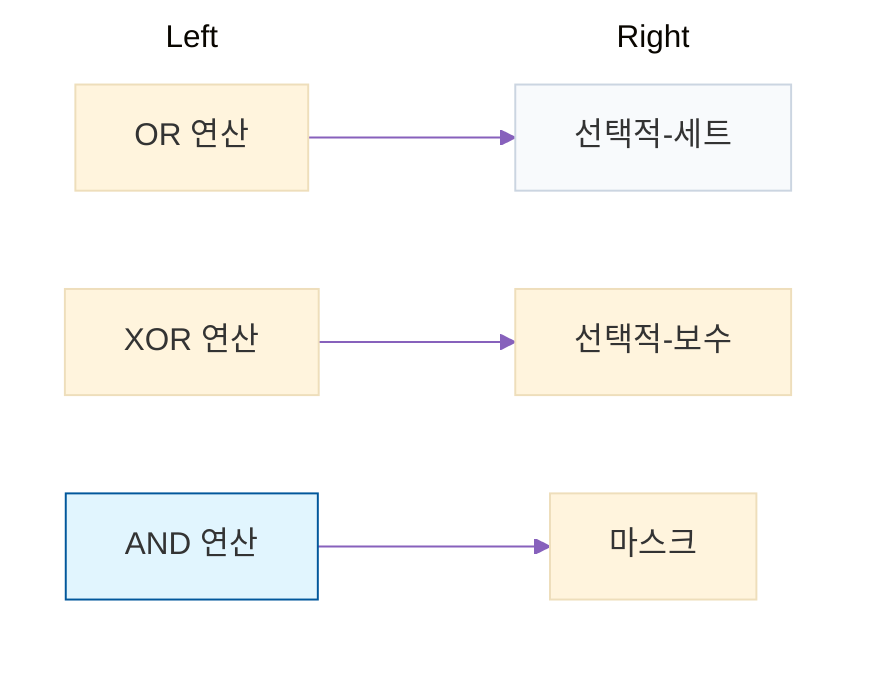

# 이번거 레전드 노가다 문제임;;;

* 3.1

|    구분     |    19     |    -19    |    124    |   -124    |
| :---------: | :-------: | :-------: | :-------: | :-------: |
| 부호화-크기 | 0001 0011 | 1001 0011 | 0111 1100 | 1111 1100 |
|  1의 보수   | 0001 0011 | 1110 1100 | 0111 1100 | 1000 0011 |
|  2의 보수   | 0001 0011 | 1110 1101 | 0111 1100 | 1000 0100 |

* 3.2

|    구분     |         19          |         -19         |         124         |        -124         |
| :---------: | :-----------------: | :-----------------: | :-----------------: | :-----------------: |
| 부호화-크기 | 0000 0000 0001 0011 | 1000 0000 0001 0011 | 0000 0000 0111 1100 | 1000 0000 0111 1100 |
|  1의 보수   | 0000 0000 0001 0011 | 1111 1111 1110 1100 | 0000 0000 0111 1100 | 1111 1111 1000 0011 |
|  2의 보수   | 0000 0000 0001 0011 | 1111 1111 1110 1101 | 0000 0000 0111 1100 | 1111 1111 1000 0100 |

* 3.6

* 3.7

$$
\begin{array}{rr}
    & 11010010_2\\
  \text{AND} & 11100000_2\\
  \hline
    & 11000000_2\\
    \text{OR} & 00001110_2\\
  \hline
  & 11001110_2\\  
\end{array}
$$

* 3.15

$$
\begin{array}{rrlll}
    & C & A & Q  & M=1001\\
    \text{[초기상태]}
    & 0 & 0000 & 0111 \\
    \\
    \text{[사이클 1]}
    & 0 & 1001 & 0111 &;Q_0=1\text{이므로} ,A\leftarrow A+M\\
    & 0 & 0100 & 1011 &;(C-A-Q) \text{시프트} \\
    \text{[사이클 2]}
    & 0 & 1101 & 1011 &;Q_0=1\text{이므로} ,A\leftarrow A+M\\
    & 0 & 0110 & 1101 &;(C-A-Q) \text{시프트}\\
    \text{[사이클 3]}
    & 0 & 1111 & 1101 &;Q_0=1\text{이므로} ,A\leftarrow A+M\\
    & 0 & 0111 & 1110 &;(C-A-Q) \text{시프트}\\
    \text{[사이클 4]} 
    & 0 & 0011 & 1111 &;Q_0=0\text{이므로} ,(C-A-Q) \text{시프트}\\
\end{array}
$$

* 3.16

$$
\begin{array}{lrrrl}
    \text{(M)} & 10101 & & & \text{초기값}:A=0000,Q_{-1}=0,\text{계수}=5\\
    (Q) & \times01101 & Q_{-1} & \text{계수}\\
    \hline \\
    (AQ) & 01011 \space 01101 & 0 & & ;(Q_0Q_{-1})=10 \text{이므로, } A \leftarrow A-M\\
    &00101 \space 10110 & 1 & 4 &;AQ_0Q_{-1} \text{산술우측 시프트} \& \text{계수 - 1}\\
    &11010 \space 10110 & 1 & & ;(Q_0Q_{-1})=01 \text{이므로,} A \leftarrow A+M\\
    &11101 \space 01011 & 0 & 3 &;AQ_0Q_{-1} \text{산술우측 시프트} \& \text{계수 - 1}\\
    &01000 \space 01011 & 0 & & ;(Q_0Q_{-1})=10 \text{이므로, } A \leftarrow A-M\\
    &00100 \space 00101 & 1 & 2 &;AQ_0Q_{-1} \text{산술우측 시프트} \& \text{계수 - 1}\\
    &00010 \space 00010 & 1 & 1 &;(Q_0Q_{-1})=11 \text{이므로, 산술우측 시프트} \& \text{계수 - 1}\\
    &10111 \space 00010 & 1 & &;(Q_0Q_{-1})=01 \text{이므로,} A \leftarrow A-M \\
    &11011 \space 10001 & 0 & 0 &;AQ_0Q_{-1} \text{산술우측 시프트} \& \text{계수 - 1 하면 계수가 0이므로 계산 종료}\\
\end{array}
$$